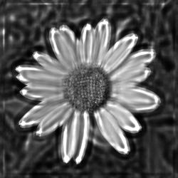
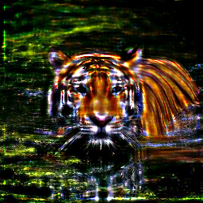

# Blur-Image

## Overview

**Blur-Image** is a compact image processing toolkit developed in Python, designed to improve image sharpness through advanced blurring techniques. Based on the Richardson-Lucy deconvolution algorithm, this toolkit allows users to apply different blur kernels and iterative enhancements to improve image quality.

## Features

- **Blurring and sharpening**: Implement Richardson-Lucy deconvolution for image blurring, as well as standard blurring techniques using different kernels.
- **Batch image processing**: Process entire directories of images for bulk blurring and sharpening.
- **Quality measurements**: Calculate and report the Peak Signal-to-Noise Ratio (PSNR) to measure the quality of processed images.
- **Visual logging**: Color-coded console for easy monitoring of processing steps.

## Installation

Clone the repository to your local machine:

```bash
git clone https://github.com/mathusanm6/Blur-Image.git
cd Blur-Image
```

### Prerequisites

Ensure you have Python installed along with the following packages:

- numpy
- scipy
- pillow (PIL)

You can install the required packages via pip:

```bash
pip install numpy scipy pillow
```

## Usage

After tuning the parameters in the `core.py` and `blind_core.py` files, you can run the toolkit using the following command:

```bash
python ./run.sh
```

## Examples and Results

Below are some examples of images processed by the Blur-Image toolkit, showing the original images, the blurred versions, and the deblurred outputs after applying various kernels and iteration counts.

### Original Image

<div style="width: 100%; text-align: center;">
  <table style="display: inline-block; text-align: center; border-collapse: collapse;">
    <tr>
      <td style="padding: 20px 0;">
        <p style="display: flex; flex-direction: column; align-items: center; margin: 0;">
          
          <sub>(1) Grayscale Flower</sub>
        </p>
      </td>
      <td style="padding: 20px 0;">
        <p style="display: flex; flex-direction: column; align-items: center; margin: 0;">
          
          <sub>(2) Tiger</sub>
        </p>
      </td>
    </tr>
  </table>
</div>

### Process

Blurring are done using the following kernels:

- Average 3x3
- Average 5x5
- Average 11x11
- Gaussian 3x3, sigma: 1.0
- Gaussian 3x3, sigma: 2.0
- Gaussian 5x5, sigma: 1.0
- Gaussian 5x5, sigma: 2.0

Sharpening are done knowing the kernel used for blurring and the number of iterations using the Richardson-Lucy deconvolution algorithm as follows:

```plaintext
Algorithm: Richardson-Lucy Deconvolution

Input:
    blurry_image: the blurred image to be deconvolved, which can be a single channel from a color image or a
    grayscale image.
    psf: the point spread function assumed to have caused the blur.
    iterations: the number of iterations for the algorithm.

Output:
    deblurred_image: the image after deconvolution.

Procedure:
1. Initialize:
    estimate = copy of blurry_image // Starting point for the estimation of the deblurred image.

2. Iterate from 1 to iterations:
    a. Convolve the estimate with the PSF
       convolved_estimate = convolve2d(estimate, psf)

    b. Compute the ratio of the blurry_image to the convolved_estimate
       ratio = blurry_image / (convolved_estimate + small_value) // small_value prevents division by zero.

    c. Convolve this ratio with the mirrored PSF (flip the PSF vertically and horizontally)
       error_estimate = convolve2d(ratio, flip(psf, vertically and horizontally))

    d. Update the estimate by multiplying it with the error_estimate
       estimate = estimate * error_estimate

3. Return the final estimate after all iterations as the deblurred_image.

```

### Processed Images

#### (1) Grayscale Flower

<table style="width: 100%; border-collapse: collapse;">
    <tr>
        <td style="text-align: center;">
            <p style="font-weight: bold;">Average 3x3</p>
        </td>
        <td style="text-align: center;">
            <p style="font-weight: bold;">Average 5x5</p>
        </td>
        <td style="text-align: center;">
            <p style="font-weight: bold;">Average 11x11</p>
        </td>
        <td style="text-align: center;">
            <p style="font-weight: bold;">Gaussian 3x3, sigma: 1.0</p>
        </td>
        <td style="text-align: center;">
            <p style="font-weight: bold;">Gaussian 3x3, sigma: 2.0</p>
        </td>
        <td style="text-align: center;">
            <p style="font-weight: bold;">Gaussian 5x5, sigma: 1.0</p>
        </td>
        <td style="text-align: center;">
            <p style="font-weight: bold;">Gaussian 5x5, sigma: 2.0</p>
        </td>
    </tr>
    <tr>
        <td colspan="7" style="text-align: center;"><strong>Blurred Images</strong></td>
    </tr>
    <tr>
        <td style="text-align: center;">
            
            <br>
        </td>
        <td style="text-align: center;">
            
            <br>
        </td>
        <td style="text-align: center;">
            
            <br>
        </td>
        <td style="text-align: center;">
            
            <br>
        </td>
        <td style="text-align: center;">
            
            <br>
        </td>
        <td style="text-align: center;">
            
            <br>
        </td>
        <td style="text-align: center;">
            
            <br>
        </td>
    </tr>
    <tr>
        <td colspan="7" style="text-align: center;"><strong>Unblurred Images</strong></td>
    </tr>
    <tr>
        <td style="text-align: center;">
            
            <br>
            <sub>5 Iterations</sub>
        </td>
        <td style="text-align: center;">
            
            <br>
            <sub>5 Iterations</sub>
        </td>
        <td style="text-align: center;">
            
            <br>
            <sub>5 Iterations</sub>
        </td>
        <td style="text-align: center;">
            
            <br>
            <sub>5 Iterations</sub>
        </td>
        <td style="text-align: center;">
            
            <br>
            <sub>5 Iterations</sub>
        </td>
        <td style="text-align: center;">
            
            <br>
            <sub>5 Iterations</sub>
        </td>
        <td style="text-align: center;">
            
            <br>
            <sub>5 Iterations</sub>
        </td>
    </tr>
    <tr>
        <td colspan="7" style="text-align: center;"></td>
    </tr>
    <tr>
        <td style="text-align: center;">
            
            <br>
            <sub>10 Iterations</sub>
        </td>
        <td style="text-align: center;">
            
            <br>
            <sub>10 Iterations</sub>
        </td>
        <td style="text-align: center;">
            
            <br>
            <sub>10 Iterations</sub>
        </td>
        <td style="text-align: center;">
            
            <br>
            <sub>10 Iterations</sub>
        </td>
        <td style="text-align: center;">
            
            <br>
            <sub>10 Iterations</sub>
        </td>
        <td style="text-align: center;">
            
            <br>
            <sub>10 Iterations</sub>
        </td>
        <td style="text-align: center;">
            
            <br>
            <sub>10 Iterations</sub>
        </td>
    </tr>
    <tr>
        <td colspan="7" style="text-align: center;"></td>
    </tr>
    <tr>
        <td style="text-align: center;">
            
            <br>
            <sub>15 Iterations</sub>
        </td>
        <td style="text-align: center;">
            
            <br>
            <sub>15 Iterations</sub>
        </td>
        <td style="text-align: center;">
            
            <br>
            <sub>15 Iterations</sub>
        </td>
        <td style="text-align: center;">
            
            <br>
            <sub>15 Iterations</sub>
        </td>
        <td style="text-align: center;">
            
            <br>
            <sub>15 Iterations</sub>
        </td>
        <td style="text-align: center;">
            
            <br>
            <sub>15 Iterations</sub>
        </td>
        <td style="text-align: center;">
            
            <br>
            <sub>15 Iterations</sub>
        </td>
    </tr>
</table>

#### (2) Tiger

<table style="width: 100%; border-collapse: collapse;">
    <tr>
        <td style="text-align: center;">
            <p style="font-weight: bold;">Average 3x3</p>
        </td>
        <td style="text-align: center;">
            <p style="font-weight: bold;">Average 5x5</p>
        </td>
        <td style="text-align: center;">
            <p style="font-weight: bold;">Average 11x11</p>
        </td>
        <td style="text-align: center;">
            <p style="font-weight: bold;">Gaussian 3x3, sigma: 1.0</p>
        </td>
        <td style="text-align: center;">
            <p style="font-weight: bold;">Gaussian 3x3, sigma: 2.0</p>
        </td>
        <td style="text-align: center;">
            <p style="font-weight: bold;">Gaussian 5x5, sigma: 1.0</p>
        </td>
        <td style="text-align: center;">
            <p style="font-weight: bold;">Gaussian 5x5, sigma: 2.0</p>
        </td>
    </tr>
    <tr>
        <td colspan="7" style="text-align: center;"><strong>Blurred Images</strong></td>
    </tr>
    <tr>
        <td style="text-align: center;">
            
            <br>
        </td>
        <td style="text-align: center;">
            
            <br>
        </td>
        <td style="text-align: center;">
            
            <br>
        </td>
        <td style="text-align: center;">
            
            <br>
        </td>
        <td style="text-align: center;">
            
            <br>
        </td>
        <td style="text-align: center;">
            
            <br>
        </td>
        <td style="text-align: center;">
            
            <br>
        </td>
    </tr>
    <tr>
        <td colspan="7" style="text-align: center;"><strong>Unblurred Images</strong></td>
    </tr>
    <tr>
        <td style="text-align: center;">
            
            <br>
            <sub>5 Iterations</sub>
        </td>
        <td style="text-align: center;">
            
            <br>
            <sub>5 Iterations</sub>
        </td>
        <td style="text-align: center;">
            
            <br>
            <sub>5 Iterations</sub>
        </td>
        <td style="text-align: center;">
            
            <br>
            <sub>5 Iterations</sub>
        </td>
        <td style="text-align: center;">
            
            <br>
            <sub>5 Iterations</sub>
        </td>
        <td style="text-align: center;">
            
            <br>
            <sub>5 Iterations</sub>
        </td>
        <td style="text-align: center;">
            
            <br>
            <sub>5 Iterations</sub>
        </td>
    </tr>
    <tr>
        <td colspan="7" style="text-align: center;"></td>
    </tr>
    <tr>
        <td style="text-align: center;">
            
            <br>
            <sub>10 Iterations</sub>
        </td>
        <td style="text-align: center;">
            
            <br>
            <sub>10 Iterations</sub>
        </td>
        <td style="text-align: center;">
            
            <br>
            <sub>10 Iterations</sub>
        </td>
        <td style="text-align: center;">
            
            <br>
            <sub>10 Iterations</sub>
        </td>
        <td style="text-align: center;">
            
            <br>
            <sub>10 Iterations</sub>
        </td>
        <td style="text-align: center;">
            
            <br>
            <sub>10 Iterations</sub>
        </td>
        <td style="text-align: center;">
            
            <br>
            <sub>10 Iterations</sub>
        </td>
    </tr>
    <tr>
        <td colspan="7" style="text-align: center;"></td>
    </tr>
    <tr>
        <td style="text-align: center;">
            
            <br>
            <sub>15 Iterations</sub>
        </td>
        <td style="text-align: center;">
            
            <br>
            <sub>15 Iterations</sub>
        </td>
        <td style="text-align: center;">
            
            <br>
            <sub>15 Iterations</sub>
        </td>
        <td style="text-align: center;">
            
            <br>
            <sub>15 Iterations</sub>
        </td>
        <td style="text-align: center;">
            
            <br>
            <sub>15 Iterations</sub>
        </td>
        <td style="text-align: center;">
            
            <br>
            <sub>15 Iterations</sub>
        </td>
        <td style="text-align: center;">
            
            <br>
            <sub>15 Iterations</sub>
        </td>
    </tr>
</table>
